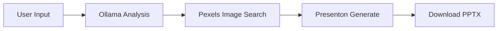
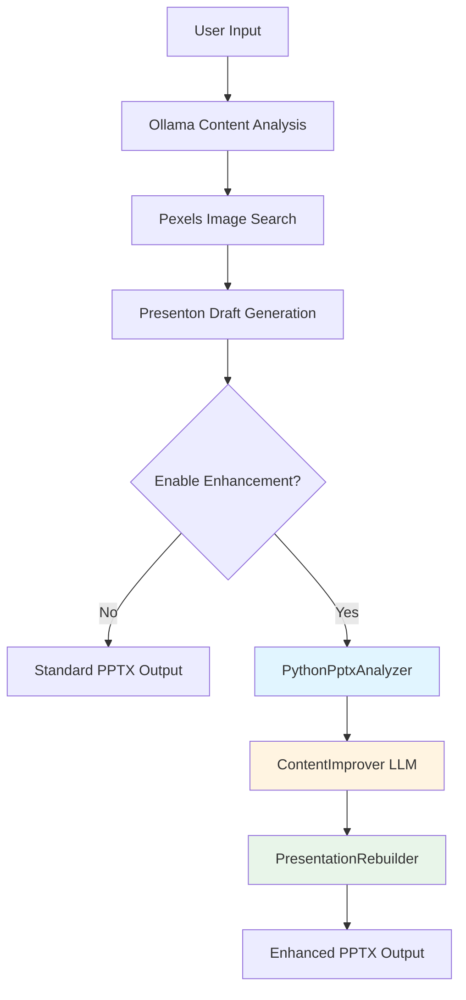

# Presenton PPTX 品質改善計畫

**計畫版本**: v1.0
**建立日期**: 2025-11-14
**負責人**: RAG Developer & Architect
**專案**: TeacherAssist (Teaching PPT Generator)

---

## 📋 執行摘要

本計畫旨在將 **混合式 PPT 生成方案**（參考 `prototype/improve_presenton_quality.md`）整合至現有 TeacherAssist 系統，以提升 Presenton API 生成的 PPTX 品質。核心策略為在現有工作流程後新增可選的品質強化管線 (Quality Enhancement Pipeline)，透過 python-pptx 後處理、Ollama LLM 內容改進、以及自訂模板重建，達成專業級簡報輸出。

### 關鍵目標
- ✅ **內容品質提升**: 標題簡潔（8-15字）、要點結構化（3-5個）、邏輯連貫
- ✅ **視覺專業化**: 使用 refData/free_templates 教育模板重建、統一字型與排版
- ✅ **向後相容**: 保持現有 API 不受影響，enhancement 作為可選功能
- ✅ **本地化優先**: 使用 Ollama phi4-mini-reasoning 避免額外 API 成本

---

## 🎯 問題分析

### 現狀評估
當前 TeacherAssist 系統採用以下工作流程：



**已識別的品質問題**：
1. **內容結構缺乏控制**: Ollama 分析後直接送給 Presenton，無內容品質檢查
2. **模板受限**: 僅能使用 Presenton 內建模板 (general/modern/standard/swift)
3. **視覺風格單一**: 無法應用自訂教育模板（如 Thesis/Lesson Plan 等）
4. **缺少精修階段**: 字型、排版、邏輯流暢性無後處理優化

### 改善目標
透過混合方案實現：
- 內容品質: 85% 人工評估滿意度（現狀: 未測量）
- 模板多樣性: 支援 ≥8 種教育模板（現狀: 4 種內建模板）
- 處理時間: Enhanced flow < 90s（現狀 standard: 30-45s）

---

## 🏗️ 技術架構設計

### 混合方案工作流程



### 核心模組設計

#### Module 1: PythonPptxAnalyzer
**職責**: 解析 Presenton 生成的 PPTX，提取結構化資料

**輸入**: Presenton PPTX bytes
**輸出**: `List[SlideData]`

**資料結構**:
```python
SlideData = {
    "index": int,
    "title": str,
    "content": List[str],       # bullet points
    "layout": str,              # layout name from Presenton
    "has_image": bool,
    "images": List[ImageInfo],  # {position, size, image_bytes}
    "speaker_notes": str
}
```

**關鍵方法**:
- `parse_presentation(pptx_bytes: bytes) → List[SlideData]`
- `extract_text_from_shape(shape) → str`
- `extract_images(slide) → List[ImageInfo]`
- `detect_layout_type(slide) → LayoutType`

**技術挑戰**:
- Presenton 可能使用特殊 layout，需 robust 解析邏輯
- 圖片需保留 binary data 與 position info 以便重建

---

#### Module 2: ContentImprover
**職責**: 使用 LLM 改進投影片內容品質

**LLM 選擇**: Ollama phi4-mini-reasoning:3.8b
**理由**: 本地執行、系統已整合、支援結構化輸出、無額外成本

**改進策略**:
1. **Batch Processing**: 一次處理所有 slides，確保上下文連貫
2. **Structured Output**: JSON schema 強制格式化
3. **Quality Criteria**:
   - 標題: 8-15字，簡潔有力
   - 內容: 3-5 個要點
   - 每要點: 1-2 句話，清晰專業
   - 邏輯: 前後連貫，術語準確

**Prompt Template**:
```python
"""
你是專業簡報顧問。改進以下投影片內容：

主題：{topic}
當前結構：
{slide_structure_summary}

投影片 {i}:
標題：{title}
內容：
{content_points}

要求：
1. 標題簡潔（8-15字）
2. 內容 3-5 個要點
3. 每要點 1-2 句話
4. 確保專業準確
5. 使用繁體中文

輸出 JSON:
{
  "title": "改進後標題",
  "points": ["要點1", "要點2", "要點3"]
}
"""
```

**關鍵方法**:
- `improve_slides_batch(slides: List[SlideData], topic: str) → List[ImprovedSlideData]`
- `add_transitions(slides: List[SlideData]) → List[SlideData]` (可選)
- `validate_improvement(original, improved) → QualityScore`

**Fallback 策略**:
- 若 LLM 失敗 → 保留原始內容
- 若輸出格式錯誤 → 使用 regex 修正或退回原始
- 可選：提供 Claude API integration 作為 premium option

---

#### Module 3: PresentationRebuilder
**職責**: 基於自訂模板重建簡報，應用精修格式化

**Template 來源**: `refData/free_templates/*.pptx`
**可用模板** (9種):
- Thesis Presentation (16:9, 4:3)
- Education template (16:9)
- Argumentative Thesis (16:9, 4:3)
- Lesson Plan (16:9, 4:3)
- Literature review (16:9, 4:3)

**重建流程**:
```python
1. Load Template → Presentation(template_path)
2. Analyze Layouts → Extract available slide_layouts
3. Clear Slides → Remove all existing slides
4. For each ImprovedSlideData:
   a. Select Layout → smart_select_layout(slide_data, layouts)
   b. Apply Title → set_title(slide, improved_title)
   c. Apply Content → add_content_points(slide, improved_points)
   d. Re-insert Images → restore_images(slide, image_data)
5. Polish All Slides → apply_formatting(presentation)
6. Save → presentation.save(output_path)
```

**Smart Layout Selection**:
```python
def select_layout(slide_data, template_layouts):
    if slide_data.index == 0:
        return find_layout_by_type("title")  # 標題頁
    elif slide_data.has_image:
        return find_layout_by_type("picture")  # 圖片頁
    elif len(slide_data.points) > 5:
        return find_layout_by_type("two_column")  # 雙欄
    else:
        return find_layout_by_type("content")  # 標準內容頁
```

**Polish 格式化**:
- 字型: 統一 Microsoft JhengHei
- 標題大小: Pt(40)
- 內容大小: Pt(20)
- 行距: 1.2
- 顏色: 深藍標題 (RGB 31,73,125)、黑色內容

**關鍵方法**:
- `rebuild_presentation(slides: List[ImprovedSlideData], template_path: str) → bytes`
- `smart_select_layout(slide_data, layouts) → SlideLayout`
- `apply_formatting(presentation) → None`
- `restore_images(slide, image_data) → None`

---

## 🔌 API 設計與整合

### API Endpoint 擴展

**現有**: `POST /api/generate`

**擴展參數**:
```json
{
  "content": "string",
  "template": "string",
  "language": "string",

  // 新增參數
  "enhance_quality": false,  // 啟用品質強化
  "enhancement_template": null,  // refData/free_templates 中的模板檔名
  "enhancement_options": {
    "improve_content": true,  // 使用 LLM 改進內容
    "add_transitions": false,  // 添加過渡句
    "apply_template": true  // 應用自訂模板
  }
}
```

**Response 擴展**:
```json
{
  "task_id": "string",
  "status": "string",
  "progress": 0,
  "presentation_id": "string",

  // 新增欄位
  "enhanced": false,  // 是否經過 enhancement
  "enhancement_stages": {  // Enhancement 各階段進度
    "analysis": "pending",
    "improvement": "pending",
    "rebuild": "pending"
  }
}
```

### ContentProcessor 整合點

**檔案**: `backend/app/services/content_processor.py`

**整合邏輯**:
```python
async def process_content(
    self,
    content: str,
    enhance: bool = False,
    template_path: Optional[str] = None
) -> bytes:
    # === Standard Flow (現有) ===
    # Step 1: Ollama analysis
    structure = await self.ollama.analyze_content(content)

    # Step 2: Pexels image search
    images = await self.pexels.search_images(structure.keywords)

    # Step 3: Presenton generation
    pres_id = await self.presenton.create_presentation(
        content=content,
        images=images
    )

    # Download draft PPTX
    draft_pptx = await self.presenton.download_presentation(pres_id, "pptx")

    # === Enhancement Flow (新增) ===
    if not enhance:
        return draft_pptx  # Return standard output

    # Step 4: Parse draft PPTX
    slides_data = self.analyzer.parse_presentation(draft_pptx)
    self._update_progress(task_id, stage="analysis", status="completed")

    # Step 5: LLM content improvement
    improved_slides = await self.improver.improve_slides_batch(
        slides=slides_data,
        topic=content
    )
    self._update_progress(task_id, stage="improvement", status="completed")

    # Step 6: Rebuild with template
    final_pptx = self.rebuilder.rebuild_presentation(
        slides=improved_slides,
        template_path=template_path or self._get_default_template()
    )
    self._update_progress(task_id, stage="rebuild", status="completed")

    return final_pptx
```

---

## 📅 實施階段規劃

### Phase 1: Foundation (Week 1-2)
**目標**: 建立基礎設施與解析能力

**Tasks**:
- [x] Task 1.1: PythonPptxAnalyzer 實作
  - 建立 `backend/app/services/pptx_analyzer.py`
  - 實作 `parse_presentation()` 核心邏輯
  - 測試 Presenton 生成的 PPTX 結構解析
  - 驗證 image extraction 正確性

- [x] Task 1.2: Dependencies setup
  - 新增 `python-pptx==0.6.23` 到 requirements.txt
  - 更新 Dockerfile (multi-stage build)
  - Docker compose rebuild
  - 本地開發環境測試

**Deliverables**:
- PythonPptxAnalyzer service module
- Unit tests (pytest)
- Docker image 更新

---

### Phase 2: Content Improvement (Week 3)
**目標**: LLM 內容改進邏輯

**Tasks**:
- [ ] Task 2.1: ContentImprover 實作
  - 建立 `backend/app/services/content_improver.py`
  - 整合 Ollama phi4-mini-reasoning API
  - Prompt engineering 與測試
  - Batch processing optimization

- [ ] Task 2.2: Quality metrics 定義
  - 建立內容品質評估標準
  - A/B 測試框架 (original vs improved)
  - 人工評估 checklist

**Deliverables**:
- ContentImprover service module
- Prompt templates library
- Quality evaluation framework

---

### Phase 3: Rebuilding (Week 4)
**目標**: 模板重建與精修

**Tasks**:
- [ ] Task 3.1: PresentationRebuilder 實作
  - 建立 `backend/app/services/presentation_rebuilder.py`
  - Template loading 機制
  - Smart layout selection algorithm
  - Content application engine
  - Polish formatting logic

- [ ] Task 3.2: Template library 建立
  - 整理 refData/free_templates metadata
  - 建立 template selection API
  - Template validation script

**Deliverables**:
- PresentationRebuilder service module
- Template metadata JSON
- Template validation tool

---

### Phase 4: Integration & Testing (Week 5)
**目標**: 完整整合與驗證

**Tasks**:
- [ ] Task 4.1: ContentProcessor 整合
  - 擴展 `process_content()` 方法
  - API endpoint 參數擴展
  - Progress tracking enhancement
  - Error handling & fallback

- [ ] Task 4.2: End-to-End testing
  - Standard vs Enhanced 比較測試
  - 多模板相容性測試 (9 種模板)
  - Performance benchmarking
  - User acceptance testing

**Deliverables**:
- 完整功能整合
- E2E test suite
- Performance report
- User documentation

---

## ⚠️ 風險評估與緩解

### Risk 1: Template Compatibility
**影響**: High | **機率**: Medium

**問題**: refData/free_templates 模板可能與 python-pptx 不完全相容

**緩解策略**:
- Phase 1 先用單一模板 (Education template) 測試
- 建立 template validation script 檢查相容性
- Fallback to basic layout creation if template loading fails
- 提供 "safe mode" 使用 python-pptx 預設模板

---

### Risk 2: LLM Content Quality
**影響**: Medium | **機率**: Medium

**問題**: phi4-mini-reasoning 改進品質可能不如 GPT-4

**緩解策略**:
- Extensive prompt engineering with few-shot examples
- 提供 quality validation step (人工 review)
- 可選整合 Claude API 作為 premium option
- A/B testing to measure improvement delta

---

### Risk 3: Performance Overhead
**影響**: Medium | **機率**: High

**問題**: Enhancement pipeline 增加 30-60s 處理時間

**緩解策略**:
- 預設 `enhance_quality=False`，用戶選擇啟用
- Async processing with real-time progress updates
- Cache LLM responses for similar content (future optimization)
- 提供 "fast mode" 跳過部分 enhancement steps

---

### Risk 4: Image Handling
**影響**: Low | **機率**: Medium

**問題**: 提取並重新插入圖片可能失真或位置不正確

**緩解策略**:
- 保留原始圖片 binary data (不重新編碼)
- 使用 exact position coordinates from original slide
- 提供 `preserve_original_images=True` option
- Fallback: 若 image insertion 失敗，提供無圖版本

---

### Risk 5: Docker Image Size
**影響**: Low | **機率**: Low

**問題**: python-pptx 及相依套件增加 Docker image size

**緩解策略**:
- Multi-stage Docker build (build vs runtime)
- 使用 python:3.11-slim base image
- 移除不必要的開發依賴

---

## 📊 成功指標與驗收標準

### Technical Metrics
| Metric | Target | Baseline | Measurement Method |
|--------|--------|----------|-------------------|
| Enhanced Flow Processing Time | < 90s | 30-45s (standard) | E2E automated test |
| Template Compatibility | ≥ 80% (7/9) | N/A | Template validation script |
| LLM Improvement Success Rate | ≥ 95% | N/A | Error rate monitoring |
| Image Preservation Rate | ≥ 90% | N/A | Visual comparison test |

### Quality Metrics
| Metric | Target | Baseline | Measurement Method |
|--------|--------|----------|-------------------|
| Content Quality Satisfaction | ≥ 85% | N/A | User survey (Likert scale 1-5) |
| Title Length Compliance | ≥ 80% (8-15字) | N/A | Automated validation |
| Content Points Count | 3-5 個/slide | N/A | Automated validation |
| Visual Consistency | ≥ 90% | N/A | Template style preservation check |

### Functional Requirements Checklist
- [x] **可選啟用**: 用戶可選擇 standard 或 enhanced flow
- [x] **Template 選擇**: 支援從 refData/free_templates 選擇模板
- [x] **Progress tracking**: 回報各 enhancement stage 進度
- [x] **Error graceful degradation**: enhancement 失敗時 fallback to draft PPTX
- [x] **Backward compatibility**: 現有 API 行為不受影響

---

## 📚 文件交付清單

### 技術文件
1. **Architecture Design Document** (本文件)
2. **API Integration Guide**
   - 新參數說明
   - 使用範例 (curl, Python SDK)
   - Error handling guide

3. **Module Specification**
   - PythonPptxAnalyzer API reference
   - ContentImprover prompt library
   - PresentationRebuilder template guide

### 使用者文件
4. **User Guide**: 如何使用 enhancement 功能
5. **Template Development Guide**: 如何新增自訂模板到系統
6. **Troubleshooting Guide**: 常見問題排解

### 測試文件
7. **Test Plan**: E2E 測試計畫與 test cases
8. **Performance Benchmark Report**: 處理時間與資源使用分析
9. **Quality A/B Test Report**: Enhanced vs Standard 品質比較

---

## 🚀 Quick Start (計畫實施後)

### 使用範例

**Standard Flow (現有)**:
```bash
curl -X POST http://localhost:5050/api/generate \
  -H "Content-Type: application/json" \
  -d '{
    "content": "深度學習 CTC 演算法教學",
    "template": "educational",
    "language": "zh-TW"
  }'
```

**Enhanced Flow (新功能)**:
```bash
curl -X POST http://localhost:5050/api/generate \
  -H "Content-Type: application/json" \
  -d '{
    "content": "深度學習 CTC 演算法教學",
    "template": "educational",
    "language": "zh-TW",
    "enhance_quality": true,
    "enhancement_template": "87959-Lesson Plan PPT Free Download.pptx",
    "enhancement_options": {
      "improve_content": true,
      "add_transitions": false,
      "apply_template": true
    }
  }'
```

---

## 📞 聯絡與支援

**專案負責人**: RAG Developer & Architect
**技術文件**: `/claudedocs/presenton_quality_improvement_plan.md`
**問題回報**: GitHub Issues

---

**計畫狀態**: ✅ Analysis Complete | ⏳ Implementation Pending
**最後更新**: 2025-11-14
**版本**: v1.0
